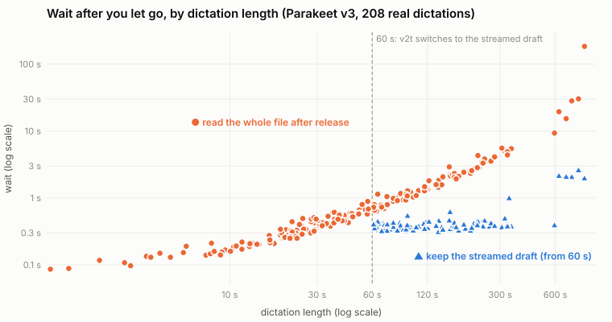

# How it works

## One dictation, start to finish

1. **Record.** The microphone opens when you press the key.
2. **Transcribe.** Parakeet turns the audio into text, on the GPU, while you are still talking.
3. **Clean up.** A small local LLM (`Qwen3.5-2B` by default) adds punctuation and drops the
   "um"s. It may not add or remove content: a chunk whose length drifts too far is pasted raw.
4. **Paste.** The text goes in at your cursor, and your previous clipboard is put back.

Both models stay loaded between dictations, so each one starts at once.

## What happens while you hold the key

- Every 5 seconds the new audio goes to Parakeet, which extends a running draft.
- The live transcript on the pill is experimental and off. With `live_transcript = true` under
  `[transcription]`, v2t also previews the newest audio every second, so words appear about 1 s
  after you say them. The preview is for display only and never changes the pasted text.
- **Under 60 seconds:** when you let go, the draft is thrown away and the whole recording is
  transcribed again in one pass. That takes about a third of a second and gives the more accurate
  text.
- **60 seconds or more:** the draft is kept and only the last few seconds are transcribed. Redoing
  the whole recording would take longer the longer you spoke: 1.5 s at the median for dictations
  over a minute, 15 to 30 s for ten-minute ones, and three minutes for one 14-minute dictation.
  Finishing the draft takes about 0.4 s whatever the length.

<small>One dot per dictation, Parakeet v3 on an M4 Pro.</small>

The draft is not kept every time because it is less accurate. To keep up live, each stretch of
audio is transcribed using only the ~20 seconds before it, and each 5 s piece is processed on its
own. On dictations over a minute the draft differs from the whole-file text in about 8% of words.
Under a minute, redoing the recording costs about the same as finishing the draft, so nothing is
gained by accepting that difference.

`v2t --streaming-mode off` (or `streaming_mode = "off"`) turns this off: nothing is transcribed
until you let go, and every recording is transcribed whole. Whisper cannot stream, so it always
works that way.

## The pill

With the [menu app](getting-started.md#the-menu-app-optional), a small speech bubble sits up and to
the right of the caret while you dictate, its tail curling down-left to just above it, so it covers
neither the caret nor the text beside it. Near the top of the screen it sits down and to the right
instead. It never takes focus, so the paste lands where you were typing.

| State | The pill shows |
|---|---|
| Recording | A waveform of the level v2t is really capturing; a flat line means the microphone is silent |
| Transcribing | A ripple |
| Cleaning up | A pulse, with a seconds counter |

- **Pill** in the menu picks where it sits: **Near text cursor** (the default), **Bottom of
  screen**, or **Off**.
- The tail finds the caret in native text views (TextEdit, Notes, Mail), and in Chrome, Brave and
  Electron apps such as Slack once the field has text; an empty Chromium field reports no caret, so
  the tail points at the field's start. In a tall pane with no caret, such as a Ghostty split, the
  pill sits at the bottom of the pane.
- After Esc, the cancelled pill shows an **Undo ⌘Z** chip for 5 s. The chip, Cmd+Z or **Undo Cancel** in the menu brings the
  dictation back and carries on recording; after 5 s the audio is dropped and Cmd+Z goes to the app
  as usual.

## Startup

- Both models load from the local cache in about 2 s.
- v2t never asks Hugging Face for updates once a model is cached, so a slow or blocked network
  cannot stall startup. Only the first download needs a connection.
